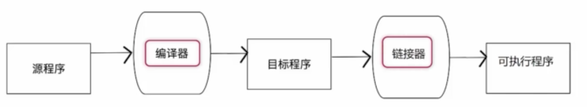
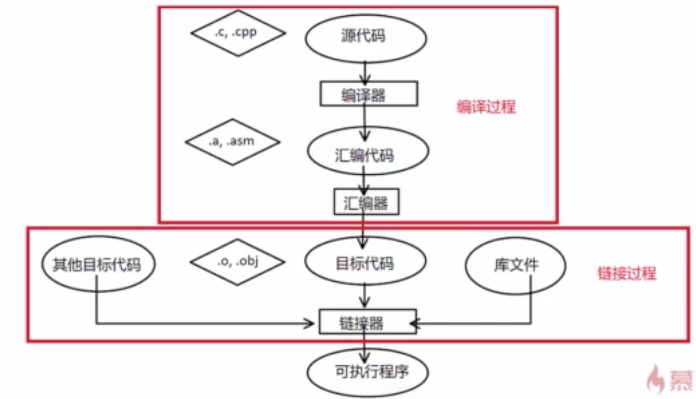

# 编译型语言
## 编程语言的层次和类型
分为四个层次.  
从上到下使用层次更接近于人类使用, 但是运行效率逐渐降低.
- 机器语言, 汇编语言.
    - 不便于人类书写.
    - 难以移植, 维护.
    - 需要在对应的编码集机器上书写运行.
- 编译型语言, 如C++, C等.
    - 更接近于人类使用的方式.
    - 编写一次, 在不同机器上编译生成对应的机器码.
    - 有一定难度.
- 解释型语言, 如Basic, Python等.
    - 通过解释器作为中间层.
- 脚本语言, 如bash, csh等.

## 编译过程
- 编译型语言一般需要经过编译和链接的过程, 才可以变成真正的可执行程序.

- 细化:

