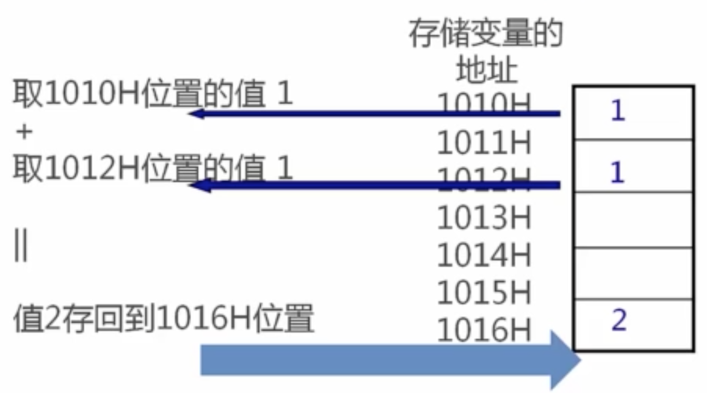
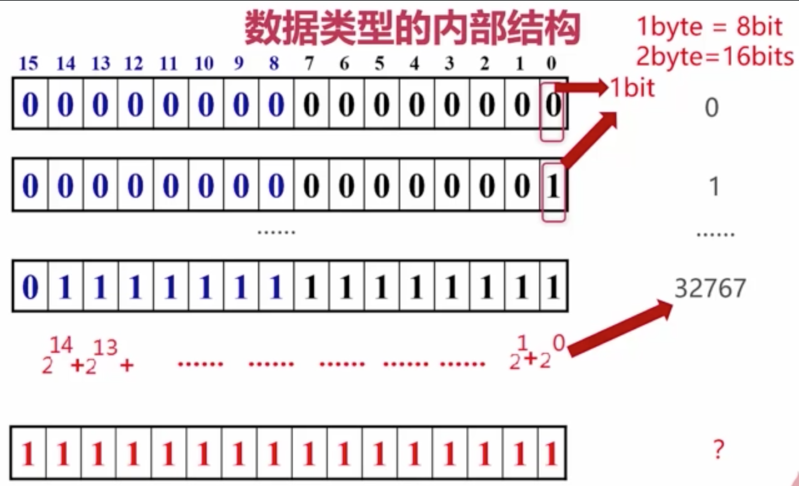

# C++数据类型
引例:
```
int sum;     // 定义整形变量
int m = 1;   // 定义整形变量
int n = 1;   // 定义整形变量
sum = m + n; // 求和赋值
```

## 进制表示
| 进制 | | | | | | | | | | | | | | | | |
| --- | --- | --- | --- | --- | --- | --- | --- | --- | --- | --- | --- | --- | --- | --- | --- | --- |
| Hex | 0 | 1 | 2 | 3 | 4 | 5 | 6 | 7 | 8 | 9 | A | B | C | D | E | F |
| Decimal | 0 | 1 | 2 | 3 | 4 | 5 | 6 | 7 | 8| 9 | 10 | 11 | 12 | 13 | 14 | 15 |
| Binary | 0000 | 0001 | 0010 | 0011 | 0100 | 0101 | 0110 | 0111 | 1000 | 1001 | 1010 | 1011 | 1100 | 1101 | 1110 | 1111 |

## 数据类型的内部结构
- C++中每个变量都有其数据类型. 数据类型决定变量所占的内存空间大小和布局方式、该空间能存储的值和范围, 以及变量能参与的运算.
- C++是强类型语言
- `1 + 1 = 2`的内存结构:


## bit和byte 比特 字节
`1 byte = 8 bit`  
`2 byte = 16 bit`  
 

## C++中的数据类型
| 名称 | 字节数 | 描述 | 范围 |
| --- | --- | --- | --- |
| `char` | 1 | 字符(character)或整数(integer). 8位 | 有符号(signed): `-128 ~ 127`  无符号(unsigned): `0 ~ 255` |
| short int (`short`) | 2 | 短整数. 16位 | 有符号(signed): `-32768 ~ 32767`  无符号(unsigned): `0 ~ 65535` |
| long int (`long`) | 4 | 长整数. 32位 | 有符号(signed): `-2147483648 ~ 2147483647`  无符号(unsigned): `0 ~ 4294967295` |
| `int` | 4 | 整数 | 有符号(signed): `-2147483648 ~ 2147483647`  无符号(unsigned): `0 ~ 4294967295` |
| `float` | 4 | 浮点数 | `3.4e+/-38` (7 digit) |
| `double` | 8 | 双精度浮点数 | `1.7e+/-308` (15 digit) |
| `long double` | 8 | 长双精度浮点数 | `1.7e+/-308` (15 digit) |
| `bool` | 1 | 布尔值. 只有`true`或`false` | `true` / `false` | 
| `wchar_t` | 2 | 宽字符(wide character). 为了存储2字节的国际字符而涉及的类型 | 一个宽字符 |

## C++中常见数据类型定义
```
char a[10] = "a";
short int s = 97;
int m = 97;
long int n = 97;
float f = 97.0f;
double d = 97.0;
long double k = 97.0;
bool b = true;
wchar_t w[10] = L"a";
```
