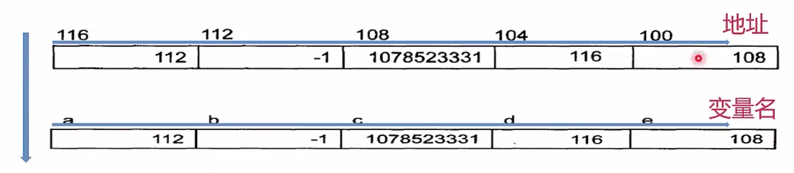

# C++的指针

- 内存由很多的内存单元组成, 这些内存单元用于存放各种类型的数据
- 计算机对于内存的每个内存单元都进行了编号, 这个编号就称为内存地址, 地址决定了内存单元在内存中的位置
- 记住这些内存单元的地址不方便, 于是C++的编译器让我们通过名字来访问这些内存位置

## 指针变量
```
int a = 112, b = -1;
float c = 3.14;
int* d = &a;
float* e = &c;
```

假设每个变量都占4byte, 这些变量在内存中的地址分布如下:



- `d`存的是`a`的位置, `e`存的是`c`的位置

## 指针的定义
### 指针定义的基本形式
- 指针本身就是一个变量, 其符合变量定义的基本形式
- 它存储的是值的地址
- 对于类型`T`, `T*`表示"到`T`的指针"类型
- 一个类型为`T*`的变量能保存一个类型`T`的对象(广义的C++的类型)的地址
```
int a = 112;
float c = 3.14;
int* d = &a;
float* e = &c;
```

### 访问
通过一个指针访问它所指向的地址的过程称为间接访问(indirection)或者引用指针(de-referencing the pointer)
- 用于执行间接访问的操作符是单目操作符`*`, 例如:
```
cout << (*d) << endl;  // 112
cout << (*e) << endl;  // 3.14
```

## 变量, 地址和指针变量
1. 一个变量有三个重要信息
    - 变量的地址
    - 变量存储的信息
    - 变量的类型
2. 指针变量是一个专门用来记录变量的地址的变量
    - 通过指针变量可以间接地访问另一个变量的值
    - 另一个变量仍然可能是一个指针变量, 于是就有多级指针