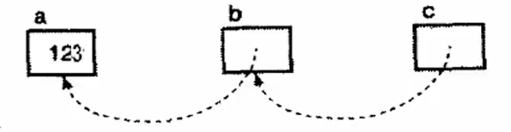

# 指向指针的指针



```
int a = 123;
int* b = &a;
int** c = &b;
```

## `*`操作符的结合性
`*`操作符必须具有从右向左的结合性
- `int** c`相当于`*(*c)`, 必须从里向外求值
- `*c`得到的是`c`指向的位置, 即`b`
- `**c`相当于`*b`, 得到了变量`a`的值

| 表达式 | 表达式的值 |
| --- | --- |
| `a` | `123` |
| `b` | `&a = a的地址` |
| `*b` | `a = 123` |
| `c` | `&b = b的地址` |
| `*c` | `b = &a = a的地址` |
| `**c` | `*b = a = 123` |