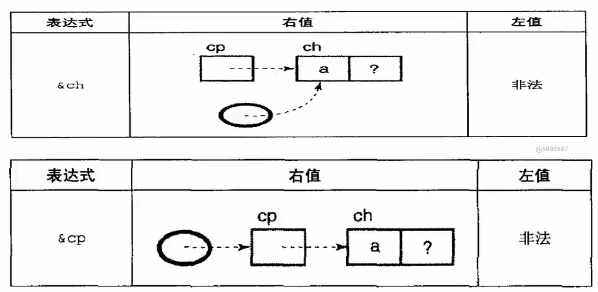
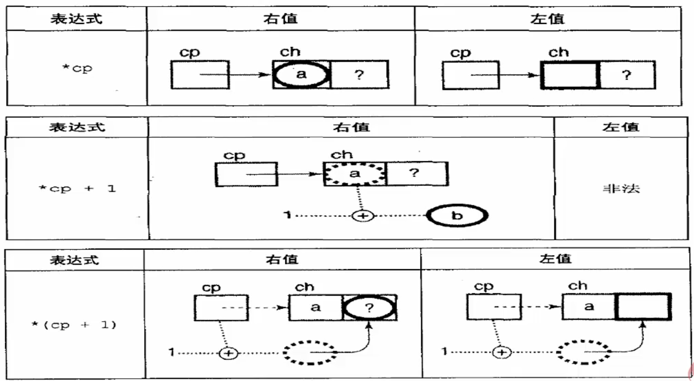

# 指针的基本运算

## `&`和`*`操作符
```
char ch = 'a';
char* cP = &ch;
```

取地址操作得到的是右值, 只能在赋值符号右侧竖线
- 左值是需要有一个具体可定位的存储区域的, 而右值不需要
- `&ch`左值非法的意思
    - 可以取出`ch`的地址, 但不会像`cP`变量那样有一个机制可以获取到这个值具体是什么, 因此不能做左值
- `&cP`左值非法的含义同上





